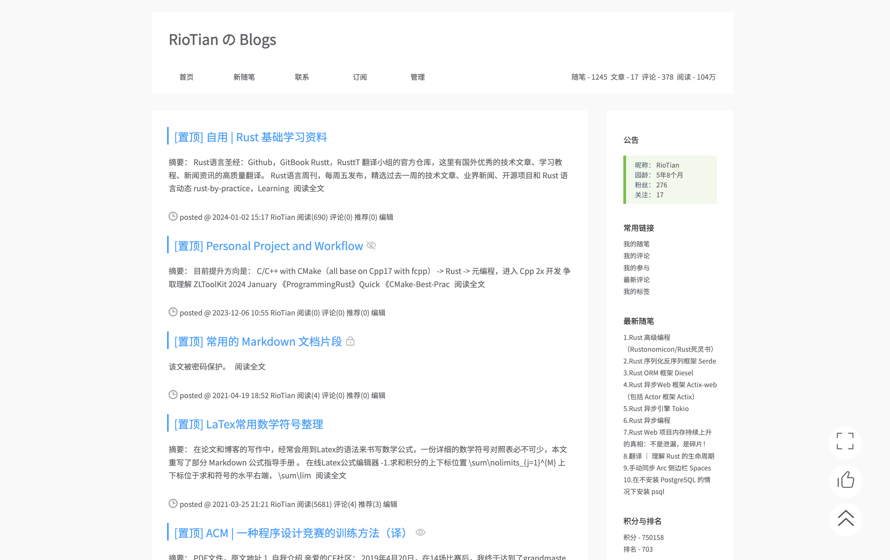
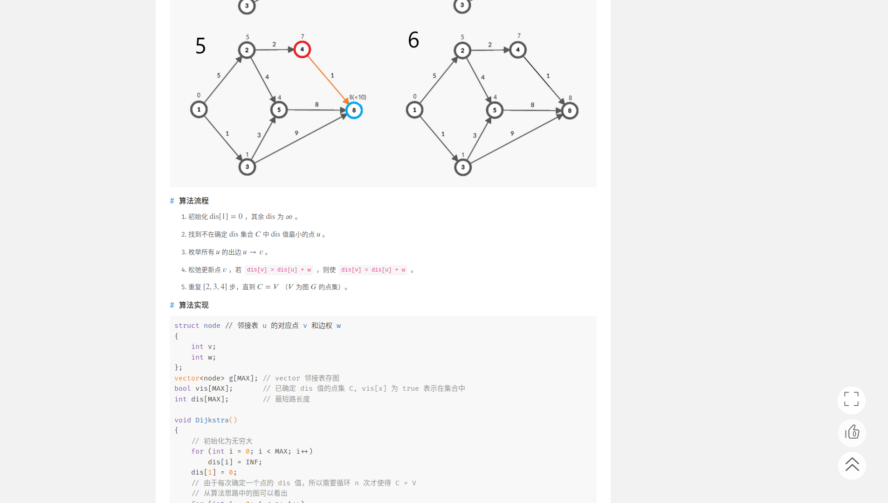
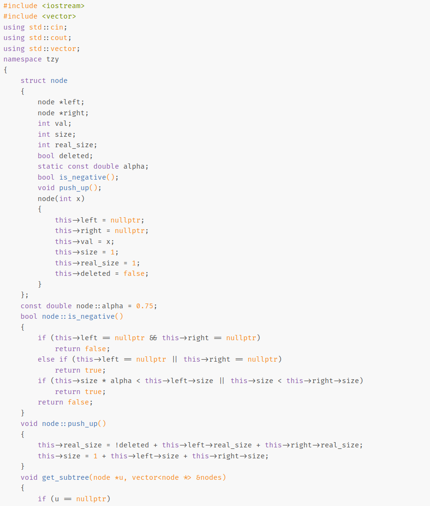

# cnblogs simple theme

演示: [RioTian's blog](https://www.cnblogs.com/RioTian)

## 简洁

## 美观

## 读者友好
用强大的 [Fira Code](https://github.com/tonsky/FiraCode) 作为代码字体，连字功能大大增加代码可读性

[Fira Code Github](https://github.com/tonsky/FiraCode)

##  安装方法

1. 向 cnblogs 申请JS权限。

2. 将 “博客皮肤” 改为 `SimpleMemory`。

3. 下载 `style.css`、`page_footer.html`、`side_bar.html` 或下载 release 中的 `simple-theme-xxx.zip`。

4. 将 `style.css` 中的内容复制到 “页面定制 CSS 代码”。

5. 将 `side_bar.html` 中的内容复制到 “博客侧边栏公告”。

6. 保存。
